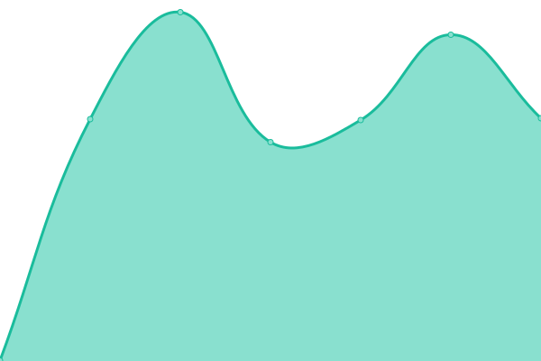

# [📈 Live Status](https://diveliastudio.github.io/upptime): <!--live status--> **🟥 Complete outage**

This repository contains the open-source uptime monitor and status page for [diveliastudio](https://diveliastudio.github.io/upptime), powered by [Upptime](https://github.com/upptime/upptime).

With [Upptime](https://upptime.js.org), you can get your own unlimited and free uptime monitor and status page, powered entirely by a GitHub repository. We use [Issues](https://github.com/diveliastudio/upptime/issues) as incident reports, [Actions](https://github.com/diveliastudio/upptime/actions) as uptime monitors, and [Pages](https://diveliastudio.github.io/upptime) for the status page.

<!--start: status pages-->
<!-- This summary is generated by Upptime (https://github.com/upptime/upptime) -->
<!-- Do not edit this manually, your changes will be overwritten -->
<!-- prettier-ignore -->
| URL | Status | History | Response Time | Uptime |
| --- | ------ | ------- | ------------- | ------ |
|  Divelia Cotis | 🟥 Down | [divelia-cotis.yml](https://github.com/diveliastudio/upptime/commits/HEAD/history/divelia-cotis.yml) | 

 322ms
     
 | 

<a href="https://diveliastudio.github.io/upptime/history/divelia-cotis">100.00%</a>
    

|  Acadia dev | 🟥 Down | [acadia-dev.yml](https://github.com/diveliastudio/upptime/commits/HEAD/history/acadia-dev.yml) | 

 610ms
     
 | 

<a href="https://diveliastudio.github.io/upptime/history/acadia-dev">99.98%</a>
    

|  Alilab | 🟥 Down | [alilab.yml](https://github.com/diveliastudio/upptime/commits/HEAD/history/alilab.yml) | 

 544ms
     
 | 

<a href="https://diveliastudio.github.io/upptime/history/alilab">99.32%</a>
    

|  Alilab front | 🟥 Down | [alilab-front.yml](https://github.com/diveliastudio/upptime/commits/HEAD/history/alilab-front.yml) | 

 204ms
     
 | 

<a href="https://diveliastudio.github.io/upptime/history/alilab-front">44.31%</a>
    

|  Refuerza | 🟥 Down | [refuerza.yml](https://github.com/diveliastudio/upptime/commits/HEAD/history/refuerza.yml) | 

 331ms
     
 | 

<a href="https://diveliastudio.github.io/upptime/history/refuerza">99.50%</a>
    

|  Refuerza front | 🟥 Down | [refuerza-front.yml](https://github.com/diveliastudio/upptime/commits/HEAD/history/refuerza-front.yml) | 

 438ms
     
 | 

<a href="https://diveliastudio.github.io/upptime/history/refuerza-front">99.55%</a>
    

|  Usamedic | 🟥 Down | [usamedic.yml](https://github.com/diveliastudio/upptime/commits/HEAD/history/usamedic.yml) | 

 306ms
     
 | 

<a href="https://diveliastudio.github.io/upptime/history/usamedic">99.59%</a>
    

|  Usamedic dev | 🟥 Down | [usamedic-dev.yml](https://github.com/diveliastudio/upptime/commits/HEAD/history/usamedic-dev.yml) | 

 154ms
     
 | 

<a href="https://diveliastudio.github.io/upptime/history/usamedic-dev">90.98%</a>
    

|  HIAS | 🟥 Down | [hias.yml](https://github.com/diveliastudio/upptime/commits/HEAD/history/hias.yml) | 

 328ms
     
 | 

<a href="https://diveliastudio.github.io/upptime/history/hias">99.73%</a>
    

<!--end: status pages-->

[**Visit our status website →**](https://diveliastudio.github.io/upptime)

## 📄 License

- Powered by: [Upptime](https://github.com/upptime/upptime)
- Code: [MIT](./LICENSE) © [diveliastudio](https://diveliastudio.github.io/upptime)
- Data in the `./history` directory: [Open Database License](https://opendatacommons.org/licenses/odbl/1-0/)
