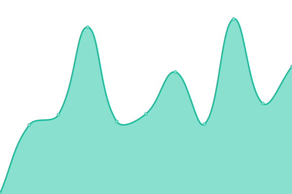

# [📈 Live Status](https://diveliastudio.github.io/upptime): <!--live status--> **🟧 Partial outage**

This repository contains the open-source uptime monitor and status page for [diveliastudio](https://diveliastudio.github.io/upptime), powered by [Upptime](https://github.com/upptime/upptime).

With [Upptime](https://upptime.js.org), you can get your own unlimited and free uptime monitor and status page, powered entirely by a GitHub repository. We use [Issues](https://github.com/diveliastudio/upptime/issues) as incident reports, [Actions](https://github.com/diveliastudio/upptime/actions) as uptime monitors, and [Pages](https://diveliastudio.github.io/upptime) for the status page.

<!--start: status pages-->
<!-- This summary is generated by Upptime (https://github.com/upptime/upptime) -->
<!-- Do not edit this manually, your changes will be overwritten -->
<!-- prettier-ignore -->
| URL | Status | History | Response Time | Uptime |
| --- | ------ | ------- | ------------- | ------ |
|  Divelia Cotis | 🟥 Down | [divelia-cotis.yml](https://github.com/diveliastudio/upptime/commits/HEAD/history/divelia-cotis.yml) | 

 266ms
     
 | 

<a href="https://diveliastudio.github.io/upptime/history/divelia-cotis">48.82%</a>
    

|  Divelia Cotis Dev | 🟩 Up | [divelia-cotis-dev.yml](https://github.com/diveliastudio/upptime/commits/HEAD/history/divelia-cotis-dev.yml) | 

 277ms
     
 | 

<a href="https://diveliastudio.github.io/upptime/history/divelia-cotis-dev">100.00%</a>
    

|  Acadia | 🟩 Up | [acadia.yml](https://github.com/diveliastudio/upptime/commits/HEAD/history/acadia.yml) | 

 463ms
     
 | 

<a href="https://diveliastudio.github.io/upptime/history/acadia">99.82%</a>
    

|  Alilab | 🟩 Up | [alilab.yml](https://github.com/diveliastudio/upptime/commits/HEAD/history/alilab.yml) | 

 233ms
     
 | 

<a href="https://diveliastudio.github.io/upptime/history/alilab">100.00%</a>
    

|  Alilab front | 🟩 Up | [alilab-front.yml](https://github.com/diveliastudio/upptime/commits/HEAD/history/alilab-front.yml) | 

 436ms
     
 | 

<a href="https://diveliastudio.github.io/upptime/history/alilab-front">100.00%</a>
    

|  Refuerza | 🟩 Up | [refuerza.yml](https://github.com/diveliastudio/upptime/commits/HEAD/history/refuerza.yml) | 

 254ms
     
 | 

<a href="https://diveliastudio.github.io/upptime/history/refuerza">100.00%</a>
    

|  Refuerza front | 🟩 Up | [refuerza-front.yml](https://github.com/diveliastudio/upptime/commits/HEAD/history/refuerza-front.yml) | 

 622ms
     
 | 

<a href="https://diveliastudio.github.io/upptime/history/refuerza-front">100.00%</a>
    

|  Usamedic | 🟩 Up | [usamedic.yml](https://github.com/diveliastudio/upptime/commits/HEAD/history/usamedic.yml) | 

 235ms
     
 | 

<a href="https://diveliastudio.github.io/upptime/history/usamedic">100.00%</a>
    

|  Usamedic dev | 🟩 Up | [usamedic-dev.yml](https://github.com/diveliastudio/upptime/commits/HEAD/history/usamedic-dev.yml) | 

 242ms
     
 | 

<a href="https://diveliastudio.github.io/upptime/history/usamedic-dev">99.67%</a>
    

|  HIAS | 🟩 Up | [hias.yml](https://github.com/diveliastudio/upptime/commits/HEAD/history/hias.yml) | 

 396ms
     
 | 

<a href="https://diveliastudio.github.io/upptime/history/hias">100.00%</a>
    

|  Términos y plazos | 🟩 Up | [terminos-y-plazos.yml](https://github.com/diveliastudio/upptime/commits/HEAD/history/terminos-y-plazos.yml) | 

 245ms
     
 | 

<a href="https://diveliastudio.github.io/upptime/history/terminos-y-plazos">99.68%</a>
    

|  MedikQuiz | 🟩 Up | [medik-quiz.yml](https://github.com/diveliastudio/upptime/commits/HEAD/history/medik-quiz.yml) | 

 238ms
     
 | 

<a href="https://diveliastudio.github.io/upptime/history/medik-quiz">100.00%</a>
    

|  PuccaSky | 🟩 Up | [pucca-sky.yml](https://github.com/diveliastudio/upptime/commits/HEAD/history/pucca-sky.yml) | 

 268ms
     
 | 

<a href="https://diveliastudio.github.io/upptime/history/pucca-sky">100.00%</a>
    

|  Botiquin | 🟩 Up | [botiquin.yml](https://github.com/diveliastudio/upptime/commits/HEAD/history/botiquin.yml) | 

 220ms
     
 | 

<a href="https://diveliastudio.github.io/upptime/history/botiquin">100.00%</a>
    

|  Doctorum | 🟩 Up | [doctorum.yml](https://github.com/diveliastudio/upptime/commits/HEAD/history/doctorum.yml) | 

 299ms
     
 | 

<a href="https://diveliastudio.github.io/upptime/history/doctorum">100.00%</a>
    

|  Alfaro Dev | 🟩 Up | [alfaro-dev.yml](https://github.com/diveliastudio/upptime/commits/HEAD/history/alfaro-dev.yml) | 

 226ms
     
 | 

<a href="https://diveliastudio.github.io/upptime/history/alfaro-dev">100.00%</a>
    

<!--end: status pages-->

[**Visit our status website →**](https://diveliastudio.github.io/upptime)

## 📄 License

- Powered by: [Upptime](https://github.com/upptime/upptime)
- Code: [MIT](./LICENSE) © [diveliastudio](https://diveliastudio.github.io/upptime)
- Data in the `./history` directory: [Open Database License](https://opendatacommons.org/licenses/odbl/1-0/)
